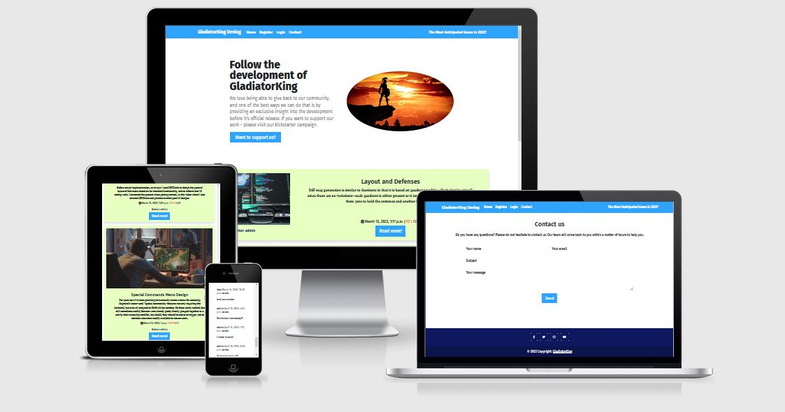
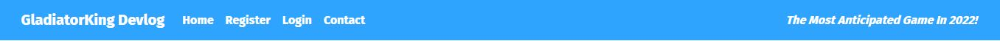
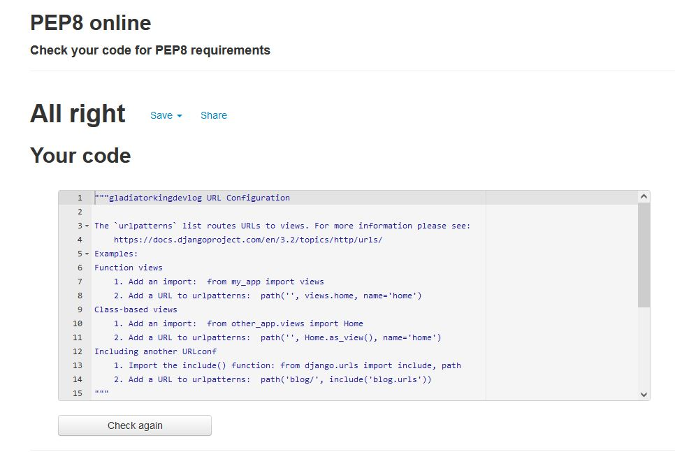

# **GladiatorKing Devlog**
GladiatorKing Devlog is a blog where you can follow the development of the game GladiatorKing. Get the latest news about the game and see what features are added week by week until the release date. If you are interested in supporting the development, you can easily visit the game's Kickstarter campaign and contribute there.

**Link to the website:** https://gladiatorking-devlog.herokuapp.com/

***

## **Features**
---
When a user performs an action on the site, the user will get an alert message at top of page that automatically disappear in 3 sec. (actions: signup, login, logout, commenting blogpost).

### **Navigation** 

Navigation menu is at the top and is easy to find and simple to use. The navigation bar includes links to Home, Register and Login - it also have a short message.

### **Main Image And Text Section**

The user can immediately see what the website is about. The site uses a big headline to capture the user interest and has a simple call to action for those who want to support the development - by clicking the button and visit their Kickstarter campaign. 

### **Blog Posts**

The user can easily see the latest blog post from the developer. They can see when the post has been published, how many people have liked and commented on it and the author. When there's over 6 blogpost published, a 'next page' button will appear at bottom, when clicked - it will load more blogposts, and a 'prev page' button will be shown instead, so the user can go back easily.

### **Footer**

A simple design that provide clear links to all social media platforms. The links opens up in a new tab when clicked. It also have a copyright text and a link to main page.

### **Sign Up**

The user can easily choose to register on the page to be able to participate in the conversation and like different posts. 

### **Sign In**

If the user already has an account, the user can easily log in by entering their details. 

### **Sign Out**

When the user chooses to log out, the user can easily do so with a simple push of a button. 

### **Blog Post Page**

The user can easily click on a specific blog post and read it. The user can also see when the blog post has been published and who wrote it. 

### **Commenting And Likes**

The user can see what other people have written below a blog post and see how many have liked it.

### **Commenting**

If the user wants to join the conversation, the user can easily comment on a blog post. 

### **Edit Comment**

If the user wants to change his comment, the user can easily do so by clicking the edit button and change it. 

### **Delete Comment**

If the user wants to delete his comment, the user can easily do so by clicking the delete button. 

### **Contact**

If the user wants to contact the website owners, the user can easily do so by using this contact form. The message can be found in Django administration under "Contacts". 

---
## **Wireframes And Design**
---
Wireframe created in Balsamiq - design of the home page. 

I also took inspiration from this website: https://startbootstrap.com/previews/clean-blog

I chose colors that clearly mark and separate different parts of the page, so that the user can easily navigate around the page without getting confused.

The typography I chose is easy to read and stands out to the user. It also gives a professional look to the overall design of the site.

---
## **Django Administration**
---

### **Admin Panel**

**From the django administration, the admin can:**

- **Create posts.** As an admin, you can choose to create a blog post. You can easily save it as a draft and continue on it later - until you are ready to publish it. 

- **Update posts.** As an admin, you can easy update a blog post if you need to change something.

- **Delete posts.** As an admin, you can easy delete a blog post if you need to.

- **Approve comments.** As an admin, you choose which comments you want to be shown on the website.

- **Delete comments.** As an admin, you can delete comments whether they are approved or not. 

- **Filter blog posts.** As an admin, you can filter the blog posts by date.

- **Delete users.** As an admin, you can delete users if you need to.

- **Submitted contacts.** As an admin, you can view messages sent by users through the website's contact form.

---
## **UX**
---

### **User Story**
*A person looking for a new game can follow the development of GladiatorKing from start to release date, and give their opinions during the development.*

- Site pagination: As a Site User I can view a list of posts so that I can select which post to view.
- View post list: As a Site User I can view a list of posts so that I can select one to read.
- Open a post: As a Site User I can click on a post so that I can read the full text.
- View likes: As a Site User I can view the number of likes on each post so that I can see which is the most popular or viral.
- View comments: As a Site User I can view comments on an individual post so that I can read the conversation.
- Account registration: As a Site User I can register an account so that I can comment and like.
- Comment on a post: As a Site User I can leave comments on a post so that I can be involved in the conversation.
- Like/Unlike: As a Site User I can like or unlike a post so that I can interact with the content.
- Edit comment: As a Site User I can edit my own comment so that I can change my opinion.
- Delete comment: As a Site User I can delete my own comment so that it disappears from the website. 

**CRUD functionality:** 
All CRUD functionalities is available for users in the front end.

### **Goals For Website Owners** 
The goal of the website is to get attention for the game during the development, and also getting people to contribute to the Kickstarter campaign. 

### **Future updates** 
- Add alot more blogposts, and a filter so users easily can sort the blogposts how they want.

- Add more features for the users, such as an option to edit/delete their accounts etc. 

---
## **Testing And Validation**
---
**Manually tested:**
- **Responsive design.** The website is tested with Chrome and Firefox developer tools on all standard screen sizes.

- **Different browsers work.** The website is tested in Chrome, Firefox, Edge and Safari

- **All links and buttons work.** Every link and button have been checked and works as planned. 

- **In admin panel everything works.** Approve comments, delete comments, create blogposts, delete blogposts, view contact messages, see all user/admin accounts. There's even a 'filter' on the right, so you easily can navigate. 

**HTML** - No errors were detected with official W3C validator.

**CSS** - No errors were detected with official (Jigsaw) validator.

**Python** - No errors were detected when testing the code on PEP8 online website.

**admin.py**

**apps.py**

**urls.py (blog)**

**forms.py** 

**urls.py (gladiatorkingdevlog)**

**models.py**

**views.py**

**Accessibility report:**

**JavaScript** - No warnings were detected when testing the code on JSHint website.

***

## **Bugs** ##
---

No bugs were detected.

### **Unfixed bugs** ###

No unfixed bugs.
***

## **Technologies Used** ##
---

### **Languages** ##
- HTML
- CSS
- Python + Django
- JavaScript

### **Programs and apps** ###
- Gitpod: Used for writing code
- Git: Used for version-control
- GitHub: Used for store data
- PostgreSQL: Database
- Cloudinary: Store images
- Summernote: WYSIWYG editor
- Bootstrap: CSS framework
- Crispy form: Manage Django forms
- Allauth: Account management
- Heroku: Cloud deployment platform
***

## **Deployment** ##
---

The site was deployed using Heroku. Code Institute instructions are found here: https://codeinstitute.s3.amazonaws.com/fst/Django%20Blog%20Cheat%20Sheet%20v1.pdf

Heroku:
1. Create an account with Heroku
2. Create a new app whilst logged in
3. Add Buildpacks 'Python' and 'NodeJS'
4. Connect your GitHub repository via "Connect to GitHub"
5. Set up your config vars (info in doc above)
6. Enable either "Automatic Deploys" or do it manually.

Link to the website: https://gladiatorking-devlog.herokuapp.com/
***

## **Credits** ##
---
In order to have time to do a large project like this in such a short time, I had to follow the Code Institute's guide (big credit) to be able to finish this website - and get it up and running without problems. 

Credit to my brother Jimmy Junttila for working with me along the project. 

Credit to the Code Institute's tutor support - for helping me out.

To complete this blog I used Code Institute's student template: https://github.com/Code-Institute-Org/gitpod-full-template

### **Images** ###
Pictures is taken from: https://www.canva.com/
### **Colors** ###
The color palette used is from: https://colorhunt.co/palette/0e185f2fa4ff00ffdde8ffc2
### **Fonts** ###
Fonts is taken from: https://fonts.google.com/
### **Icons** ###
Icons is taken from: https://fontawesome.com/
### **Blog posts** ###
Blog posts content is taken from: https://www.gridsagegames.com/blog/
