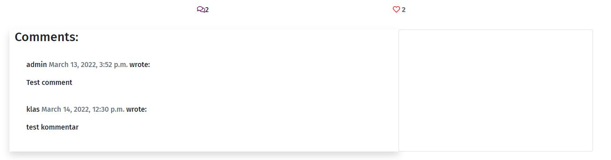
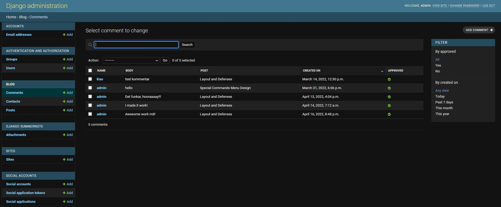

# **GladiatorKing Devlog**
GladiatorKing Devlog is a blog where you can follow the development of the game GladiatorKing. Get the latest news about the game and see what features are added week by week until the release date. If you are interested in supporting the development, you can easily visit the game's Kickstarter campaign and contribute there.

**Link to the website:** https://gladiatorking-devlog.herokuapp.com/

***

## **Features**
---

### **Navigation** 

Navigation menu is at the top and is easy to find and simple to use. When the user hovers over the links, it changes color to indicate it is clickable.

### **Main Image And Text Section**

The user can immediately see what the website is about. The site uses a big headline to capture the user interest and has a simple call to action for those who want to support the development - by clicking the button and visit their Kickstarter campaign. 

### **Blog Posts**

The user can easily see the latest blog post from the developer. They can see when the post has been published, how many people have liked and commented on it and the author.

### **Footer**

A simple design that provide clear links to all social media platforms. The links opens up in a new tab when clicked. 

### **Sign Up**

The user can easily choose to register on the page to be able to participate in the conversation and like different posts. 

***

### **Sign In**

If the user already has an account, the user can easily log in by entering their details 

***

### **Sign Out**

When the user chooses to log out, the user can easily do so with a simple push of a button. 

### **Blog Post Page**

The user can easily click on a specific blog post and read it. The user can also see when the blog post has been published and who wrote it. 

### **Commenting And Likes**

The user can see what other people have written below a blog post and see how many have liked it.

### **Commenting**

If the user wants to join the conversation, the user can easily comment on a blog post. 

---
## **Django Administration**
---

### **Admin Panel**

**From the django administration, the admin can:**
- **Create posts.** As an admin, you can choose to create a blog post. You can easily save it as a draft and continue on it later - until you are ready to publish it. 
- **XYZ**

## **UX**
---

### **User Story**
A person interested in space wants to test their knowledge of the subject by doing a fun quiz. Once the quiz is done, the user can redo the quiz to get a higher score or challenge family and friends to try to beat him. 

### **Goals For Website Owners** 
The goal of the website is to entertain the user with a quiz. It provides the user with spacerelated questions to give the user a challenge in their area of interest. The user will also leave the quiz with a new knowledge. 

### **Wireframe** ###
Was inspired by this design when I built spaceQuiz. 

***

## **Testing And Validation**
---
- **Responsive design.** The website is tested with Chrome and Firefox developer tools on all standard screen sizes.

- **Different browsers work.** The website is tested in Chrome, Firefix, Edge and Safari

- **All links and buttons work.** Every link and button have been checked and works as planned. 

**HTML** - No errors were detected with official W3C validator.

Link: https://validator.w3.org/nu/?doc=https%3A%2F%2Fdanjtl.github.io%2FspaceQuiz%2F

**CSS** - No errors were detected with official (Jigsaw) validator.

Link: https://jigsaw.w3.org/css-validator/validator?uri=https%3A%2F%2Fdanjtl.github.io%2FspaceQuiz%2F&profile=css3svg&usermedium=all&warning=1&vextwarning=&lang=sv

**JavaScript** - No warnings were detected when testing the code on JSHint website.

Link: https://jshint.com/

**Accessibility report:**

***

## **Bugs** ##
---

No bugs were detected.

### **Unfixed bugs** ###

No unfixed bugs.
***

## **Technologies Used** ##
---

### **Languages** ##
- HTML
- CSS
- JavaScript

### **Programs** ###
- Gitpod: Used for writing code.
- Git: Used for version-control.
- GitHub: Used for store data and hosting platform.
***

## **Deployment** ##
---

The site was deployed with GitHub.
Steps to deployment:
- Navigate to Settings tab
- Select Pages from the side menu
- Under the source drop-down menu, select Main

Link to the website: https://danjtl.github.io/spaceQuiz/
***

## **Credits** ##
---
Credit to my brother Jimmy Junttila to help me solve a few functions. 
I have taken inspiration from a YouTube channel called Florin Pop. Some code used in this video, was partially used for my own application. -  https://www.youtube.com/watch?v=dtKciwk_si4&t=3514s
### **Images** ###
Pictures is taken from https://www.canva.com/
### **Colors** ###
The color palette used is from https://paperheartdesign.com/blog/color-palette-awesome-space
### **Fonts** ###
Fonts is taken from https://fonts.google.com/
### **Icons** ###
Icons is taken from https://fontawesome.com/
### **Questions** ###
Questions is taken from:
- https://icebreakerideas.com/space-trivia/
- https://quizglobal.com/quizplay/quizplayqanda/Space%20Quiz%20Questions%20and%20Answers
### **Codes** ###
 
- JavaScript code - learned "checked radiobutton" code here: https://tinyurl.com/59ddenvd
- JavaScript code - learned play again button here: https://tinyurl.com/39e3f3pn
- JavaScript code - learned code here: https://tinyurl.com/yc5a78th
